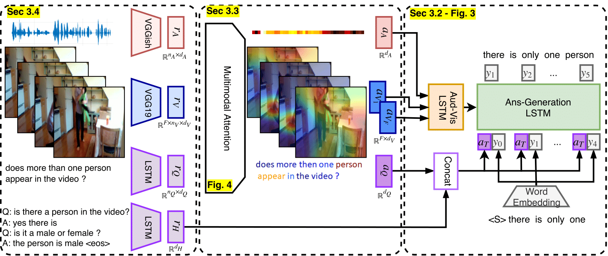

#  Simple Baseline For Audio-Visual Scene-Aware Dialog

This repository is the implementation of [A Simple Baseline for Audio-Visual Scene-Aware Dialog
](https://arxiv.org/abs/1904.05876v1). 



The code is based on [Hori’s naive baseline](https://github.com/dialogtekgeek/AudioVisualSceneAwareDialog). We thank AVSD team for dataset and sharing implementation code.

## Required packages

- python 2.7
- pytorch 0.4.1
- numpy
- six
- java 1.8.0   (for coco-evaluation tools)

# Data

We use AVSD v0.1 official train-set. For validation and evaluation we use the prototype val-set and test-set. See [DSTC7 AVSD challenge](https://github.com/hudaAlamri/DSTC7-Audio-Visual-Scene-Aware-Dialog-AVSD-Challenge)  for more details. Please cite AVSD if you use their dataset.

Download AVSD annotations from this [link](https://technionmail-my.sharepoint.com/:u:/r/personal/idansc_campus_technion_ac_il/Documents/Deep/AudioVisualSceneAwareDialog/data/data_dl/annotations.tar?csf=1&e=kfZfl5), and extract to ‘data/’


Download audio-video related features from this [link](https://technionmail-my.sharepoint.com/:u:/g/personal/idansc_campus_technion_ac_il/EQqfg7BwrxdPrAoKG9REl8UBsFr0kH8ccEtVhTdw499bNQ?e=9mpi1j), and extract to ‘data/charades_features’

# Run

The run script have 4 stages

- stage 1 - preparation of dependent packages
- stage 2 - training
- stage 3 - generation of sentences on test-set
- stage 4 - evaluation of generated sentences


Use: ```$ ./run —stage X``` to run desired stage.
